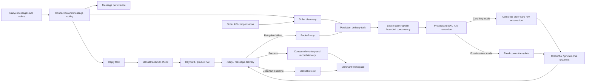

# XianYuSmart

**English** | [简体中文](README.md)

[](https://github.com/Evvvvvvvan/XianYuSmart/stargazers)
[](https://github.com/Evvvvvvvan/XianYuSmart/forks)
[](https://github.com/Evvvvvvvan/XianYuSmart/releases/latest)
[](#star-history)
[](https://www.oracle.com/java/technologies/downloads/#java21)
[](https://spring.io/projects/spring-boot)
[](https://vuejs.org/)
[](https://www.mysql.com/)
[](LICENSE)

> **Automate virtual product ordering, delivery, support, and reviews as much as possible. Routine orders run unattended while exceptions are handled in one place.**

XianYuSmart is a virtual product operations system for Xianyu in multi-tenant environments. After a buyer places an order, the platform can automatically deliver fixed resources or card keys based on the product and reach the buyer through delivery credentials, private chat, or both channels. Common inquiries, receipt guidance, and review follow-ups before and after a transaction can also be handled automatically according to configured rules. Merchants only need to focus on cases that genuinely require attention, such as low inventory, disconnected accounts, delivery failures, and pending reviews.

The system does more than send a block of text after receiving an order. It connects **order discovery, idempotent queuing, inventory reservation, dual-channel delivery, failure retries, and manual review** into a complete recoverable workflow. Fixed content and card-key delivery modes are strictly mutually exclusive, while accounts, products, messages, orders, inventory, tasks, and AI knowledge bases are isolated by tenant. Core task workflows rely only on MySQL, without requiring Redis or a message queue, balancing deployment cost with future extensibility.

Current version: [2.0.7](https://github.com/Evvvvvvvan/XianYuSmart/releases/tag/v2.0.7) · [View changelog](CHANGELOG.md)

[Community & Support](#community--support) · [Benefits for Merchants](#benefits-for-merchants) · [Technical Highlights](#technical-highlights) · [Problems Solved](#problems-solved) · [Feature Scope](#feature-scope) · [Feature Entry Points & Setup Order](#feature-entry-points--setup-order) · [Business Workflow](#business-workflow) · [Technical Baseline](#technical-baseline) · [Container Image Deployment](#container-image-deployment) · [Quick Start](#quick-start) · [Configuration](#configuration) · [Development Build](#development-build) · [Build & Verification](#build--verification) · [Directory Responsibilities](#directory-responsibilities) · [Routine Operations](#routine-operations) · [Usage Boundaries](#usage-boundaries) · [License & Disclaimer](#license--disclaimer) · [Star History](#star-history)

## Community & Support

Issues, experience, and suggestions from real-world use help make XianYuSmart more stable and easier to use. Join the WeChat group to discuss deployment configuration, connection troubleshooting, automated delivery, and operational practices. If the project saves time or solves a practical business problem, voluntary donations are also welcome to support ongoing maintenance.

<table>
  <tr>
    <td width="50%" align="center" valign="top">
      <strong>Join the WeChat Group</strong>
      <p>Discuss configuration, troubleshooting, and practical experience with maintainers and users, and stay informed about project progress. Feature requests, shared practices, and project contributions are all welcome.</p>
      
      <p><sub>The QR code expires periodically and will be updated in the repository</sub></p>
    </td>
    <td width="50%" align="center" valign="top">
      <strong>Support the Project</strong>
      <p>Every contribution supports documentation improvements, compatibility verification, issue fixes, and continued maintenance. Any amount is an encouragement to keep the project moving forward.</p>
      
      <p><sub>Donations are entirely voluntary and do not include commercial services, feature priority, or any commitment</sub></p>
    </td>
  </tr>
</table>

## Benefits for Merchants

| Scenario | What XianYuSmart Automates | Direct Benefit |
| --- | --- | --- |
| Selling cloud-drive links, tutorials, or other fixed resources | Reuses fixed-content templates and automatically substitutes member names, order numbers, and delivery content | No repeated copy-and-paste for every order |
| Selling activation codes, redemption codes, or membership cards | Reserves card keys according to order quantity, then consumes them and records their destination after successful delivery | Reduces duplicate keys, missing keys, and inventory discrepancies |
| Card keys supplied by an existing procurement system | Calls an HTTPS API for each order, uses an idempotency key to prevent duplicate purchases, and sends uncertain results for manual verification | No need to preload all inventory, and timeouts do not cause blind duplicate charges |
| Buyers need to receive content promptly | Delivery credentials and private chat can be enabled independently or used together | Delivery content is easier to find, reducing repeated inquiries |
| Repetitive inquiries consume too much time | Replies using keywords, product-specific rules, or an AI knowledge base, with support for manual takeover | Common questions are handled automatically while complex conversations remain available for manual handling |
| Follow-up is required after buyers confirm receipt | Sends custom receipt messages in order and performs reviews according to configuration | After-sales guidance follows a consistent process without relying on memory |
| Many products require centralized maintenance | Reuses fixed templates, card-key warehouses, review message pools, and batch rules | Less duplicate configuration; one change can apply to multiple products |
| Service restarts, network instability, or API failures occur | Recovers persistent tasks automatically, retries with backoff, and sends uncertain outcomes for manual review | Exceptions are neither silently lost nor blindly resent |
| Multiple merchants share the same platform | Isolates business data and AI knowledge bases by tenant | Each merchant manages only their own accounts, products, orders, and configuration |
| Returning buyers must be identified or risky buyers must be excluded from automation | Automatically accumulates buyer interactions and transaction data, with labels, notes, and automation pause states | Customer relationships are clearer, and exceptional buyers no longer trigger automated replies or delivery |
| Critical exceptions require timely notification | Sends Webhook notifications for disconnected accounts, expired credentials, delivery exceptions, and low inventory while retaining delivery logs | No need to watch the dashboard continuously to notice cases requiring intervention |

For buyers, the core experience is **faster content delivery after ordering, clearer delivery entry points, and faster answers to common questions**. For merchants, the main shift is from processing every order manually to configuring rules, handling exceptions, and reviewing results.

## Technical Highlights

| Engineering Design | Implementation | Value |
| --- | --- | --- |
| Atomic card-key delivery | Uses MySQL row-level locks to reserve a complete order, consumes inventory after successful delivery, and releases or sends it for manual review after failure | Prevents duplicate keys, missing keys, and overselling under concurrent orders |
| Recoverable task queues | Persists order and reply tasks with worker leases, timeout recovery, and backoff retries | Processing continues after a process exit or server restart |
| Idempotent dual entry points | Queues WebSocket real-time events and order API compensation uniformly by order number | Balances real-time processing and completeness without delivering the same order twice |
| Multi-tenant data boundaries | Enforces tenant isolation through `TenantContext`, tenant fields, composite unique indexes, and database migrations | Prevents accounts, orders, inventory, configuration, and knowledge bases from leaking across tenants |
| Real-time message pipeline | Uses Java-WebSocket access, MessagePack decoding, message persistence, and asynchronous business processing | Long-running business work does not block persistent connection reception |
| Isolated AI customer service | Uses Spring AI, tenant-specific dynamic clients, and separate vector stores, supporting keywords, product rules, and manual takeover | AI can be configured per tenant while deterministic rules remain available at any time |
| Lightweight runtime boundaries | Uses bounded thread pools, finite task queues, batch claiming, and database connection pool limits | Controls resource usage without requiring heavyweight middleware |
| Strategy-based extensibility | Parses fixed-content/card-key delivery strategies and keyword/AI reply strategies independently | New delivery or reply modes can be added without rewriting the main workflow |
| Idempotent external procurement | Uses order-level request tokens, response quantity validation, and uncertain-result isolation | Prevents duplicate purchasing and incorrect delivery when integrating external card-key systems |
| Proactive notifications and diagnostics | Supports multi-channel notifications, signature validation, SSRF protection, and a unified exception view with processing states | Critical events arrive promptly, while resolved historical exceptions stop causing distraction |

This implementation is suitable for studying **reliable task scheduling, event-driven automation, multi-tenant data isolation, virtual inventory consistency, and AI customer service orchestration**. The repository provides a complete loop from the frontend workspace and backend state machine to database migrations and container deployment, rather than code that only supports a single happy path.

> If these engineering challenges are also important, Star the repository to follow its progress. For custom delivery or reply workflows, Fork the project and extend the existing strategy interfaces.

## Problems Solved

| Operational Problem | Solution |
| --- | --- |
| Duplicate, missing, or oversold card keys | MySQL row-level locks, complete-order reservation, consumption after successful delivery, and release or manual review after failure |
| Lost order or reply tasks after a service restart | Persistent delivery and reply tasks that recover automatically after lease expiration |
| Duplicate delivery triggered by multiple entry points | Idempotent queuing by order number, with WebSocket and API discovery entering the same task queue |
| Uncontrolled resource usage during message spikes | Shared bounded thread pools, finite queues, batch claiming, and connection pool limits |
| Incorrect automated customer service replies | Persistent manual takeover state, with keyword, product, and AI replies evaluated using a unified result model |
| Inventory and failure conditions discovered too late | A dashboard that centralizes available card keys, low inventory, pending cases, review-required cases, and failed tasks |
| Business data shared accidentally between merchants | Tenant isolation for accounts, products, messages, orders, card keys, settings, tasks, and AI knowledge bases |
| Disconnected product publishing and distribution workflows | Unified orchestration for source collection, product selection, materials, batch publishing, deletion, and compensation tasks |
| Reviews and product refreshes depend on manual inspection | Product management centralizes review switches, trigger modes, message pools, batch application, and daily deduplicated refreshes; the order page handles manual and mutual reviews |
| Unclear public network access boundaries | The application binds only to a local port while Nginx provides HTTPS, rate limiting, and reverse proxying |
| Buyer information scattered across messages and orders | Buyer profiles are created automatically and aggregate interactions, orders, transaction totals, labels, and operational notes |
| External procurement timeouts leave payment status uncertain | Retries use a fixed idempotency key, while uncertain network outcomes lock the order for manual verification |

## Feature Scope

| Operations Automation | Reliable Delivery | Multi-Tenant Operations |
| --- | --- | --- |
| Accounts, cookies, connections, and disconnect alerts | Atomic multi-quantity card-key reservation and idempotent delivery | Automatic MySQL schema creation and version migrations |
| Products, SKUs, delivery rules, and card-key warehouses | Delivery task retries, lease recovery, and manual review | Docker Compose, health checks, and HTTPS proxying |
| Strictly exclusive fixed-content/card-key modes, with independently enabled credential and chat channels | Manual takeover and delayed reply recovery | Business data backups and operation logs |
| Keyword, product-level, and AI automated replies | Full traceability for messages, orders, and delivery results | Sensitive values such as cookies, API keys, and email passwords excluded by default |
| Revenue, delivery, replies, inventory, and exception workspace | Failed tasks collected in a centralized queue | Bounded thread pools, connection pools, and batch scheduling parameters |
| Materials, addresses, sources, product selection, and publishing rules | Automatic/manual reviews, custom messages, automatic product refreshes, and order status tracking | Tenant-specific AI clients, configuration, and vector stores |
| Commission accounts, distribution settlement, and compensation tasks | Published ID write-back, short-link repair, and coupon binding | Announcements, feedback, risk events, and operation logs |
| Buyer labels, notes, and risk automation pauses | Local inventory and external API card-key supply | Webhook notifications, delivery logs, and system diagnostics |

## Feature Entry Points & Setup Order

Each automation capability maintains its switches and templates in one business module. Other pages only display status, execution results, or links to the configuration entry point, preventing settings in multiple places from overriding each other.

| Single Configuration Entry Point | Responsibilities |
| --- | --- |
| Connection Management | Cookie updates, connection status, WebSocket reconnection, and account health checks |
| Product Management | Product synchronization and editing, automatic review rules, review message pools, batch application, and automatic product refreshes |
| Fixed Content Templates | Reusable fixed delivery content and variable templates for download links, instructions, and similar resources |
| Card-Key Warehouses | Local card-key inventory, external procurement APIs, batch imports, inventory alerts, and usage records |
| Automated Delivery | Selects fixed-content or card-key mode for a product and configures the master switch, credential delivery, and private-chat delivery |
| Automated Replies | Keywords, product-specific replies, AI replies, and manual takeover settings |
| Buyer Management | Views buyer interactions, orders, and transaction data, and maintains labels, notes, and automation pause states |
| Orders & Reviews | Views fulfillment status, manual reviews, mutual reviews, and failed retries without maintaining automatic review rules |
| Notifications & Diagnostics | Checks account, delivery, reply, and inventory exceptions; marks one or many as processed; configures notification channels and views delivery logs |
| Operation Logs & System Settings | Queries business operations, exception causes, and tenant-specific system parameters |

Recommended setup order:

1. Add a Xianyu account in Connection Management and confirm that the Cookie is valid and WebSocket is connected.
2. Synchronize products. Create a fixed-content template for fixed resources, or create a card-key warehouse and import inventory for card-key products.
3. Choose exactly one delivery mode for each product in Automated Delivery, then enable credential and private-chat channels as needed.
4. Configure keyword, product-specific, or AI reply strategies in Automated Replies.
5. Configure automatic review modes and messages centrally in Product Management, and enable automatic product refreshes as needed.
6. Review execution results and exception tasks under Orders & Reviews, Operation Logs, and the dashboard queue.

## Business Workflow



### Product Operations Loop

`Source collection -> selection rules -> material library -> single or batch publishing -> product ID write-back -> automatic refresh/reviews -> distribution settlement`

- Publishing and deletion rules generate persistent tasks on a per-tenant schedule and retry failures with backoff.
- Compensation tasks uniformly handle published product ID write-back, in-app short-link repair, and coupon warehouse binding.
- Announcements, feedback, risk events, and task results enter the operations center for tenant-specific tracing.
- The dashboard provides quick-start guidance and direct links to core features. The operations center provides usage guides, module descriptions, required-field validation, and next-step prompts. Automatic review rules are maintained centrally in Product Management, while the order page only handles manual reviews and mutual review results.

### Delivery States

`PENDING -> PROCESSING -> SUCCESS`

- Temporary network or API failure: `PROCESSING -> RETRY -> PENDING`
- Retry limit exceeded or uncertain delivery result: `PROCESSING -> REVIEW_REQUIRED`
- Unexpected process exit: claim again after the lease expires

### Card-Key States

`AVAILABLE -> RESERVED -> USED`

- Inventory is reserved only when the complete order quantity is available.
- Inventory becomes `USED` only after message delivery is confirmed.
- Confirmed delivery failures release inventory back to `AVAILABLE`.
- Uncertain delivery outcomes preserve the association and enter manual review to prevent duplicate delivery.

## Technical Baseline

- Java 21
- Spring Boot 3.5
- MySQL 5.7+
- Flyway
- MyBatis-Plus
- Vue 3, TypeScript, Vite
- Docker Compose
- Nginx

## Container Image Deployment

Every official Release automatically publishes a `linux/amd64` image to GitHub Container Registry. Fixed versions are suitable for production deployment, while `latest` is intended for trying the latest official release.

```bash
docker pull ghcr.io/evvvvvvvan/xianyusmart:v2.0.7
docker pull ghcr.io/evvvvvvvan/xianyusmart:latest
```

Start a fixed version using the repository's Docker Compose configuration:

Linux:

```bash
cp .env.example .env
# Update the database password and strong JWT secret in .env
export APP_IMAGE=ghcr.io/evvvvvvvan/xianyusmart:v2.0.7
docker compose pull app
docker compose up -d --no-build
```

Windows PowerShell:

```powershell
Copy-Item .env.example .env
notepad .env
$env:APP_IMAGE = 'ghcr.io/evvvvvvvan/xianyusmart:v2.0.7'
docker compose pull app
docker compose up -d --no-build
```

The image still depends on the MySQL, JWT, and cross-origin settings in `.env`. Windows Docker Desktop must use Linux container mode. Pin a version tag in production to avoid unplanned changes from updates to `latest`.

## Quick Start

### Requirements

- Docker Engine 24+ or Docker Desktop
- Docker Compose v2
- At least 2 CPU cores and 2 GB of memory recommended for Linux production environments
- Windows can use Docker Desktop for functional testing

### Linux

```bash
chmod +x install.sh
./install.sh
```

### Windows PowerShell

```powershell
Copy-Item .env.example .env
notepad .env
docker compose up -d --build
docker compose ps
```

All four example secrets in `.env` must be changed before startup. `JWT_SECRET` and `ACCOUNT_DATA_ENCRYPTION_KEY` must each contain at least 32 random bytes, and database passwords must not be reused. The account-data key decrypts cookies, tokens, and browser state; store it durably after first use because replacing it directly makes existing credentials unreadable.

Open `http://localhost:12400` after startup.

A fresh database opens the tenant account creation page on first access. When tenants already exist, a new tenant can still be registered from the login page. Password length is limited to 8–72 characters.

### Public HTTPS

1. Save the certificates as:

```text
deploy/nginx/certs/fullchain.pem
deploy/nginx/certs/privkey.pem
```

2. Update `.env`:

```dotenv
ALLOWED_ORIGINS=https://shop.example.com
TRUST_PROXY=true
```

3. Start the proxy profile:

```bash
docker compose --profile proxy up -d --build
```

4. After pointing the domain to the server, open `https://shop.example.com`.

The application container exposes port 12400 only on `127.0.0.1`, and all public traffic passes through Nginx. MySQL and port 12400 must not be exposed directly in production.

## Configuration

Copy `.env.example` to `.env`, then update it for the environment:

| Variable | Description | Recommended Value |
| --- | --- | --- |
| `DB_NAME` | MySQL database name | `xianyusmart` |
| `DB_USERNAME` | Application database account | Dedicated least-privilege account |
| `DB_PASSWORD` | Application database password | Random strong password |
| `DB_ROOT_PASSWORD` | MySQL root password | Different from the application password |
| `JWT_SECRET` | Login token signing secret | At least 48 random bytes |
| `ACCOUNT_DATA_ENCRYPTION_KEY` | Cookie, token, and browser-state encryption key | Independent random value of at least 48 bytes; do not replace after first use |
| `ALLOWED_ORIGINS` | Frontend origins allowed to access the application | Complete HTTPS domain |
| `TRUST_PROXY` | Whether proxy headers are trusted | Set to `true` only behind Nginx |
| `UPDATE_RELEASE_API` | GitHub Releases API | Uses this project's latest Release by default; leave empty to disable update checks |
| `DB_POOL_MAX_SIZE` | Maximum database connections | Default `10` for a single instance |
| `DB_POOL_MIN_IDLE` | Minimum idle connections | Default `2` |
| `JAVA_OPTS` | JVM container memory policy | Default value is suitable for small instances |

The following tuning variables can be added under `app.environment` in `compose.yaml`:

| Variable | Default | Purpose |
| --- | ---: | --- |
| `EXECUTOR_CORE_SIZE` | 4 | General business worker threads |
| `EXECUTOR_MAX_SIZE` | 8 | Maximum general business worker threads |
| `EXECUTOR_QUEUE_CAPACITY` | 500 | Bounded task queue capacity |
| `DELIVERY_CLAIM_BATCH_SIZE` | 20 | Delivery tasks claimed per cycle |
| `DELIVERY_DISPATCH_DELAY_MS` | 1000 | Delivery scheduling interval |
| `DELIVERY_LEASE_SECONDS` | 120 | Task processing lease |
| `DELIVERY_MAX_ATTEMPTS` | 3 | Maximum delivery attempts |
| `PRINT_RAW_MESSAGE` | false | Raw message logging; keep disabled in production |

Before increasing concurrency, evaluate Xianyu API rate limits, active tenant count, MySQL connections, and server memory together. Keep the defaults first and use the exception queue to identify real bottlenecks before tuning.

## Development Build

### Local Development on Windows

Prepare Java 21, Node.js 20+, and MySQL 5.7+, then create the database and account:

```sql
CREATE DATABASE xianyusmart CHARACTER SET utf8mb4 COLLATE utf8mb4_unicode_ci;
CREATE USER 'xianyusmart'@'localhost' IDENTIFIED BY 'replace-with-strong-password';
GRANT ALL PRIVILEGES ON xianyusmart.* TO 'xianyusmart'@'localhost';
FLUSH PRIVILEGES;
```

Backend:

```powershell
$env:DB_PASSWORD = 'replace-with-strong-password'
$env:JWT_SECRET = 'replace-with-at-least-32-random-bytes'
.\mvnw.cmd spring-boot:run
```

Frontend:

```powershell
Set-Location vue-code
npm ci
npm run dev
```

The frontend development server runs at `http://localhost:5173` and proxies API requests to `http://localhost:12400`.

## Build & Verification

```powershell
Set-Location vue-code
npm ci
npm run type-check
npm run build:spring
Set-Location ..
.\mvnw.cmd clean test
.\mvnw.cmd clean package
```

On Linux, replace `mvnw.cmd` with `./mvnw`.

## Directory Responsibilities

```text
src/main/java/com/xianyusmart/
├─ controller/          HTTP APIs and workspace aggregation
├─ service/             Account, message, reply, delivery, operations orchestration, and persistent tasks
├─ service/delivery/    Text and card-key delivery strategies
├─ websocket/           Xianyu persistent connections, routing, and reconnection
├─ mapper/              MySQL data access and task locking
├─ interceptor/         Authentication boundaries
├─ backup/              Optional data backups
└─ config/              Thread pools, web, database, and AI configuration

src/main/resources/
├─ db/migration/        Flyway database schema
├─ static/              Built Vue frontend
└─ application.yaml     Runtime parameters

vue-code/src/
├─ api/                 Frontend API wrappers
├─ components/          Shared components and layouts
├─ views/               Merchant business pages
├─ utils/               Request, notification, and confirmation utilities
└─ assets/              Minimal commercial theme

deploy/nginx/            HTTPS, rate limiting, and reverse proxy
compose.yaml             Application, MySQL, and Nginx orchestration
```

## Routine Operations

View status and logs:

```bash
docker compose ps
docker compose logs -f --tail=200 app
docker compose logs -f --tail=200 mysql
```

After updating local code:

```bash
docker compose up -d --build
```

Back up MySQL:

```bash
docker compose exec mysql mysqldump -uxianyusmart -p xianyusmart > xianyusmart.sql
```

Stop application writes and verify the backup file before restoring. Business data exports do not include sensitive configuration such as cookies, AI keys, or email passwords. Runtime environment variables and certificates must be preserved separately for disaster recovery.

## Usage Boundaries

- Xianyu APIs, cookies, and risk-control policies may change, so account status and exception queues require ongoing attention.
- Automation frequency must comply with platform rules and must not be used for fraud, harassment, or bypassing platform security mechanisms.
- Public deployments must enable HTTPS, strong passwords, a host firewall, and regular backups.
- Fresh environments use MySQL; automatic migration from historical SQLite data is not provided.

## License & Disclaimer

This project uses the [PolyForm Noncommercial License 1.0.0](LICENSE) and is licensed only for personal learning, technical research, experiments, and other noncommercial purposes.

**All commercial use is prohibited**, including sales, paid deployment, hosting services, SaaS, managed operations, commercial lead generation, paid training, and direct or indirect profit through advertising, subscriptions, commissions, or value-added services.

- Usage must comply with applicable laws and regulations, Xianyu's platform terms of service, and account usage rules.

Downloading, copying, modifying, deploying, running, or distributing this project indicates acceptance of the [complete usage restrictions and disclaimer](DISCLAIMER.md).

## ⭐ Star History

<a href="docs/assets/star-history-light.png">
  <picture>
    <source media="(prefers-color-scheme: dark)" srcset="docs/assets/star-history-dark.png" />
    <source media="(prefers-color-scheme: light)" srcset="docs/assets/star-history-light.png" />
    
  </picture>
</a>
<sub>Generated by <a href="scripts/gen_star_history.py"><code>scripts/gen_star_history.py</code></a> and updated daily by <a href=".github/workflows/star-history.yml">GitHub Actions</a> · Click the image to view it at full size</sub>
